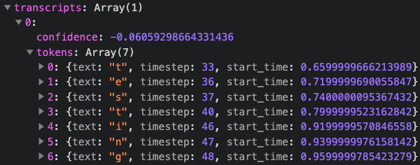

# Language Confidence Fluency

## Installation

These instructions were written while testing against Ubuntu 20.04.

However, most of the development was done on a Debian image, so hopefully you can get things running
on your preferred distro without too much trouble.

**Dependencies**
- Docker (`sudo apt install docker.io`)
- NodeJS (Install [nvm](https://github.com/nvm-sh/nvm), `nvm i 16`)

**Steps**
1. `npm install`
2. `npm run build`
3. `sudo docker build . -t fluency` (~4min)
4. `sudo docker run --rm -it -p36582:36582 fluency:latest`

Visit `localhost:36582` to view the frontend.

## Notes

- If this is running remotely, you need to configure access to that port, which depends on your
server infrastructure. It's entirely possible that this doesn't need to be exposed to the public
internet - you can use the api by POSTing your audio file to `/analyze`.
  - (For development, I use VS Code's remote-ssh plugin which provides secure port forwarding
    functionality.)
- GPU support has been included but it is not necessary and doesn't appear to help very much. Having
said that, I haven't tested the number of concurrent requests the server can handle, and it's very
possible the GPU would enable a much higher capacity per node. If your machine has a GPU and you'd
like to use it, you need to add the `--gpus all` flag to to the docker command above.
- The frontend has been included, which isn't actually necessary. I'm not sure it makes much
difference though, so it's included. All the analysis is done in python which has a CLI at
`analyzer/cli/py` if you'd like to abstract this out.

## Future Work Ideas

- Implement streaming
- Clean separation of API and frontend
- Minimize resulting docker image size (currently 3.16GB), especially if frontend and/or gpu aren't
needed
- Experiment with tensorflow-lite builds for increasing performance / concurrency limits
- Improve disfluent detection by updating the actual underlying model using fine-tuning
- Use fine-tuning (or from-scratch) to retrain deepspeech to recognize phonemes
- Figure out why the GPU doesn't help very much, possibly unblock GPU acceleration
- Research CPU and GPU options
- Make the embedded python server use a separate thread for each request (if it isn't already)
- Increase threshold for `<pause>` based on surrounding punctuation
- This repo could use some more general tidying if it becomes long lived and actively developed
  - E.g. having local python venv installed breaks the docker build

## How I Built This

1. Got [deepspeech](https://deepspeech.readthedocs.io/) running and saw output like this:

2. I was always going to do a bunch of open-ended experimentation before diving into this project,
so I quickly locked on to how to cool it was to have timestamps for each letter and wanted to see
this visualized.
3. Frontend demo was part of the requirement. Built that using
[WebRTC recorder API](https://developer.mozilla.org/en-US/docs/Web/API/MediaStream_Recording_API),
ffmpeg to convert from the web's opus codec, and [Preact](https://preactjs.com/). It's a NodeJS
backend both to provide the API and to serve the frontend. It initially ran deepspeech via an npm
module which was convenient.
4. Iterated on the frontend to visualize the timing information, in particular the
[`TranscriptionPlayer`](./src/web-frontends/recorder/TranscriptionPlayer.tsx).
5. I also wanted to compare deepspeech's output to a target transcript. I'm familiar with diffing
from git/etc and applied
[this implementation](https://gist.github.com/adamnew123456/37923cf53f51d6b9af32a539cdfa7cc4) to
produce a character-by-character diff.
6. I augmented the diff with the timing data and updated the frontend to visualize this new combined
output.
7. Lots of thinking about strategies to use this as a base for flagging disfluent features.
8. Deepspeech has a hot words feature for configuring additional sensitivity on certain words. I
doing this with 'um', 'er', etc. This didn't work very well, and also made it produce strange
results in samples without any disfluent features.
9. I tried [building a new language model](https://deepspeech.readthedocs.io/en/r0.9/Scorer.html)
(aka 'scorer') to include disfluent words. This is the part of deepspeech which is just trained on
text and calculates probabilities of character combinations that is used internally to help the
network correctly interpret the audio data. I thought the language model might be responsible for
discarding ums/uhs/etc since they don't occur in its training data. I was successful in producing
a new language model that included lots of artificially inserted ums/uhs/etc in the training data,
but it was completely unsuccessful in actually helping deepseech to produce these in its output.
10. The analysis was supposed to be in python, but I was using NodeJS/TypeScript. That still made
sense for the frontend and also the vanilla backend stuff (serving js, accepting the opus data via
http, converting to wav via ffmpeg), but I ported the actual analysis to python to fulfil the
requirements.
11. I pursued a manual approach. I noticed that deepspeech could actually run without a language
model, and while its accuracy suffered, it sometimes produced output for disfluent words.
12. I created a list of the character sequences that deepspeech would sometimes output when
processing disfluent words. The sequences used are a bit odd, I assume because the network doesn't
think words like 'um' exist, but this didn't really matter. I just flagged words from this list as
disfluents when the diff analysis considered them to be insertions into the target transcript.
13. I started analyzing the raw audio data in the gaps between words. I figured if deepspeech was
discarding them, then all I needed to do was determine 'is the user speaking' during these gaps, and
if so, flag them as disfluents. I got as far as calculating the volume,
14. but I soon realized that detections of volume coincided with deepspeech outputting two space
characters instead of just one. This was super easy to miss before, especially since I had long been
inserting lots of spaces in the gaps for visualization purposes. Turns out deepspeech outputs a
space when there are gaps between voice features. Makes sense. I've long suspected that training
data includes examples of users speaking disfluents but not including them in the transcript, so the
network learns to ignore them. However, after ignoring, it still detects another gap before the next
word, and outputs another space. Therefore, double spaces are disfluents.
15. I added a threshold of 0.8 seconds between words and flagged these as `<pause>` disfluents.
16. Bundled everything together with docker and added instructions.
17. Got docker version working with GPUs and tried it out on GCP. GPUs are a pain and unfortunately
I wasn't rewarded very much. It was a little better though, and I still think it's possible GPUs
will allow much more concurrent requests.
